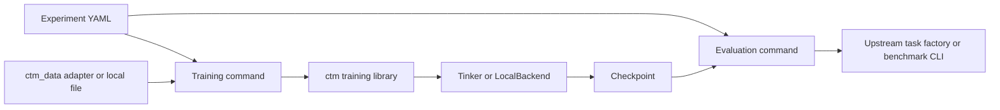

# Consistency Training Methods

Consistency Training Methods (CTM) is a research framework for training a model
to exhibit consistent behaviour across related prompts. It provides:

- reinforcement-learning consistency training (RLCT);
- supervised and representation-consistency training (`bct`, `act`, `attct`,
  and `mlpct`);
- Tinker and local PyTorch/PEFT training backends;
- explicit adapters for `mcq-bias`, WildJailbreak, and EvalAwareBench; and
- a setting-independent evaluation runner for upstream Inspect tasks.

Training and evaluation are independent. An experiment specifies the training
data and training grader separately from the evaluation dataset, task, scorer,
and judge. CTM does not infer an evaluation split or replace a benchmark's
official evaluation method.

## Architecture



The dependency boundary is deliberate:

- `ctm/` contains generic training, backend, artifact, and evaluation code.
- `ctm_data/adapters/` contains benchmark-specific training adapters and data
  builders.
- `experiments/` contains reproducible YAML composition files.
- `scripts/` contains generic command-line entry points.

The `ctm/` package must not import concrete adapters or benchmark packages.

## Installation

Install the complete experiment environment:

```bash
uv venv
uv pip install -r requirements.txt
uv pip install -e . --no-deps
```

For the generic CTM library without repository-provided adapter dependencies,
install `requirements-ctm.txt` instead of `requirements.txt`.

Store credentials in a gitignored environment file. Relevant variables include
`TINKER_API_KEY`, `OPENROUTER_API_KEY`, `OPENAI_API_KEY`, and
`WANDB_API_KEY`. Never place credentials in YAML files or inline JSON arguments.

## Experiment configuration

[`experiments/example_rlct.yaml`](experiments/example_rlct.yaml) demonstrates an
RL training stage and an independent official `mcq-bias` evaluation stage:

```yaml
training:
  command: ["${python}", scripts/train_rlct.py]
  args:
    setting_factory: ctm_data.adapters.mcq_bias:create_setting
    setting_config:
      data_paths: ["${training_data}"]
    experiment_name: "${experiment}"
    run_name: main

evaluation:
  - name: mcq-bias-official
    command: ["${python}", scripts/run_evals.py]
    args:
      task_factory: mcq_bias.tasks:suite_tasks
      task_args:
        datasets: [truthfulqa, logiqa]
        n_questions: 250
      tinker_checkpoint: "${checkpoint}"
```

Inspect or execute the plan with:

```bash
uv run python scripts/run_experiment.py \
  experiments/example_rlct.yaml \
  --training-data /absolute/path/to/train.jsonl \
  --dry-run

uv run python scripts/run_experiment.py \
  experiments/example_rlct.yaml \
  --training-data /absolute/path/to/train.jsonl

uv run python scripts/run_experiment.py \
  experiments/example_rlct.yaml \
  --stages evaluation \
  --checkpoint tinker://...
```

The runner prints the resolved YAML and exact commands before execution.
`--dry-run` performs no child command. Without `--yes`, execution requires one
confirmation after the plan is printed.

`${training_data}` is supplied by `--training-data`. `${checkpoint}` is either
supplied by `--checkpoint` or obtained from the single selected training stage.
The runner rejects an implicit `${checkpoint}` when multiple training stages
are selected because checkpoint ownership would be ambiguous.

Top-level `variables` provide experiment-owned values without command-line
overrides. A named training command publishes its result as
`${training.NAME.checkpoint}`. This permits a single YAML file to route several
training runs to their corresponding evaluations while retaining the safe
rejection of an ambiguous `${checkpoint}`.

Named checkpoints are persisted in
`logs/experiments/<experiment>/outputs.json`. A later
`--start-from evaluation` or `--stages evaluation,analysis` invocation reloads
these values. The runner does not infer task dependencies or skip completed
commands; stage selection remains explicit.

## RL consistency training

RLCT consumes a `Setting` factory in `module:callable` form. A setting supplies
datapoints, related prompt builders, a scalar trait grader, and an optional
answer parser.

```bash
uv run python scripts/train_rlct.py \
  --backend tinker \
  --model Qwen/Qwen3-30B-A3B-Instruct-2507 \
  --setting-factory ctm_data.adapters.eval_awareness:create_setting \
  --setting-config /absolute/path/to/setting-config.json \
  --load-config '{"n_datapoints":100}' \
  --experiment-name eval-awareness \
  --run-name f6 \
  --dry-run
```

The default advantage normalization scope is `per_item`; `pooled` remains
available through `--normalization`. Use `--help` for all sampling, anchor,
optimizer, and backend options.

### RLCT semantics

For each datapoint, CTM samples the reference prompt and every selected training
variant. The trait grader maps each successfully judged response to a scalar.
The resulting reference and variant rates define the consistency reward.

- `per_item` normalization treats one datapoint and its related inputs as one
  group. This is the default because one datapoint cannot change another
  datapoint's advantage scale.
- `pooled` normalization standardizes the corresponding reward population over
  the complete optimizer batch.
- `anchor_weight` divides the final gradient scale between consistency and
  reference anchoring. A value of `0` disables anchoring; a value of `1`
  disables the consistency term.
- `anchor_model: base` compares the current reference rate with samples from the
  unmodified base model. `initial_policy` compares it with the policy state at
  the start of the run.
- Anchor sampling requests reference indices only. Each reference index is
  compared with its own initial rate.

The refusal grader retries provider and parsing failures. Its default
`failure_policy: abstain` means that an unjudgeable response is recorded as a
grader failure and excluded from rates and gradients; it does not abort the
run. Set the policy to `raise` for a fail-fast diagnostic run. If all usable
advantages in a batch are zero or missing, CTM records the batch and skips the
optimizer update.

## SFT and representation consistency

`scripts/train_bct.py` is file-driven:

```bash
uv run python scripts/train_bct.py \
  --method bct \
  --data /absolute/path/to/train.jsonl \
  --experiment-name supervised \
  --run-name main
```

`act`, `attct`, and `mlpct` require the local backend. Pair-field names are
explicit. Native `mcq-bias` files use `unbiased_messages` and
`biased_messages`; see [ctm_data/README.md](ctm_data/README.md).

Select an internal-consistency method and its loss options directly in YAML:

```yaml
training:
  name: attct
  command: ["${python}", scripts/train_bct.py]
  args:
    backend: local
    method: attct
    method_config:
      layer_selection: all
      layer_weights: uniform
    data: [/absolute/path/to/paired-prompts.jsonl]
    experiment_name: internal-consistency
    run_name: attct
```

See
[experiments/internal_consistency/README.md](experiments/internal_consistency/README.md)
for the method boundary, supported options, a four-method YAML matrix, and
named checkpoint routing.

## Evaluation

`scripts/run_evals.py` runs the task, solver, scorer, and judge returned by an
upstream Inspect task factory:

```bash
uv run python scripts/run_evals.py \
  --task-factory mcq_bias.tasks:suite_tasks \
  --tinker-checkpoint tinker://... \
  --task-args '{"datasets":["truthfulqa"],"n_questions":250}' \
  --generation-config '{"max_tokens":32768}'
```

The runner provides model/checkpoint bridging and Inspect runtime options. It
does not replace benchmark scoring. An experiment may invoke a benchmark's own
CLI directly when no Inspect factory is available.

LocalBackend LoRA checkpoints use `--local-checkpoint file:///...`. The runner
reads the recorded base model from the checkpoint manifest, loads it through
Inspect's Hugging Face provider, and applies the PEFT adapter. Full-weight local
checkpoints are not supported by this bridge.

## Outputs and observability

Training outputs are written to `logs/<experiment>/<run>/`:

- `manifest.json` records the model, backend, resolved configuration, and data
  provenance;
- `config.json`, `metrics.jsonl`, and `logs.log` record local configuration and
  metrics;
- `checkpoints.jsonl` records saved checkpoint paths; and
- `rollouts/` contains compressed JSONL sampling records and `index.json`.

Every sampled RL response is saved by default, including rate-only samples,
initial-anchor samples, failed resampling attempts, grader failures, and
zero-signal samples. Each record contains `skipped_from_training` and, when
applicable, a `skip_reason`. Read or filter records with:

```python
from ctm.evals.analysis.rollouts import iter_rollouts, load_index

directory = "logs/EXPERIMENT/RUN/rollouts"
print(load_index(directory))
for rollout in iter_rollouts(directory, skipped_from_training=True):
    print(rollout.skip_reason, rollout.completion_text)
```

Set `rollout_log="none"` in `RLConfig` only when response persistence is not
permitted. Weights & Biases is disabled by default. Enable it explicitly with
`wandb_project` in experiment YAML or `--wandb-project` on a training CLI.

The grader-health metrics are:

- `rollout/grader_sample_count`;
- `rollout/grader_failure_count`; and
- `rollout/grader_failure_rate`.

Grader failures are excluded from rates and gradients but remain in the rollout
log.

Checkpoint scheduling is based on attempted global steps. Consult
`train/skipped_empty_batch` together with `checkpoints.jsonl` when determining
whether a checkpoint followed an optimizer update.

## Data and provenance

Native `mcq-bias` rows are loaded from the exact paths listed by the experiment.
WildJailbreak and EvalAwareBench source rows are converted into immutable
fixed-family artifacts with content-hashed manifests. Builders create training
artifacts only; they do not create evaluation splits.

Artifact loaders verify schema version, row count, and SHA-256 before training.
An explicit `n_datapoints` request must be satisfiable. Train/evaluation overlap
is controlled by the experiment author.

See [ctm_data/README.md](ctm_data/README.md) for source schemas, builder commands,
and adapter configuration. See
[experiments/eval_awareness/README.md](experiments/eval_awareness/README.md) for
the standalone EvalAwareBench F6 experiment and VS Code debugging workflow.

## Verification

Run the complete offline suite:

```bash
uv run python -m pytest
```

In a core-only environment, use `uv run python -m pytest tests`. Supplying the
`tests` path overrides the repository-wide test paths, so adapter tests and
their optional dependencies are not collected.
