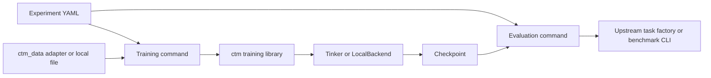

# Consistency Training Methods

Consistency Training Methods (CTM) is a research framework for training a model
to exhibit consistent behaviour across related prompts. It provides:

- reinforcement-learning consistency training (RLCT);
- supervised and representation-consistency training (`bct`, `act`, `attct`,
  and `mlpct`);
- Tinker and local PyTorch/PEFT training backends;
- explicit adapters for `mcq-bias`, WildJailbreak, and EvalAwareBench; and
- a setting-independent evaluation runner for upstream Inspect tasks.

Training and evaluation are independent. An experiment specifies the training
data and training grader separately from the evaluation dataset, task, scorer,
and judge. CTM does not infer an evaluation split or replace a benchmark's
official evaluation method.

## Architecture



The dependency boundary is deliberate:

- `ctm/` contains generic training, backend, artifact, and evaluation code.
- `ctm_data/adapters/` contains benchmark-specific training adapters and data
  builders.
- `experiments/` contains reproducible YAML composition files.
- `scripts/` contains generic command-line entry points.

The `ctm/` package must not import concrete adapters or benchmark packages.

## Installation

Install the complete experiment environment:

```bash
uv venv
uv pip install -r requirements.txt
uv pip install -e . --no-deps
```

Chart rendering runs in a separate final `rendering` stage, so only the
machine that renders needs a chart toolchain, and any machine can re-render
later from the synced results with `--start-from rendering`. The mcq-bias
publication renderer uses Matplotlib from the Python environment. Experiments
whose rendering stage uses Flint instead also require Node.js and the pinned
JavaScript dependencies:

```bash
npm ci
```

The publication-style mcq-bias renderer uses Matplotlib from the Python
environment and does not require Node. Flint remains the compact quick-look
path for ordinary declarative charts.

Store credentials in a gitignored environment file. Relevant variables include
`TINKER_API_KEY`, `OPENROUTER_API_KEY`, `OPENAI_API_KEY`, and
`WANDB_API_KEY`. Never place credentials in YAML files or inline JSON arguments.

## Experiment configuration

[`experiments/example_rlct.yaml`](experiments/example_rlct.yaml) demonstrates an
RL training stage and an independent official `mcq-bias` evaluation stage:

```yaml
training:
  command: ["${python}", scripts/train_rlct.py]
  args:
    setting_factory: ctm_data.adapters.mcq_bias:create_setting
    setting_config:
      data_paths: ["${training_data}"]
    experiment_name: "${experiment}"
    run_name: main

evaluation:
  - name: mcq-bias-official
    command: ["${python}", scripts/run_evals.py]
    args:
      task_factory: mcq_bias.tasks:suite_tasks
      task_args:
        datasets: [truthfulqa, logiqa]
        n_questions: 250
      tinker_checkpoint: "${checkpoint}"
```

Inspect or execute the plan with:

```bash
uv run python scripts/run_experiment.py \
  experiments/example_rlct.yaml \
  --training-data /absolute/path/to/train.jsonl \
  --dry-run

uv run python scripts/run_experiment.py \
  experiments/example_rlct.yaml \
  --training-data /absolute/path/to/train.jsonl

uv run python scripts/run_experiment.py \
  experiments/example_rlct.yaml \
  --stages evaluation \
  --checkpoint tinker://...
```

The runner prints the authored YAML, the resolved-plan identity, and every
exact command before execution. `--dry-run` performs no child command. Without
`--yes`, execution requires one confirmation after the plan is printed.

Independent commands within a stage can run concurrently on a multi-GPU host:

```bash
uv run python scripts/run_experiment.py experiment.yaml \
  --parallel 8 --gpus 0,1,2,3,4,5,6,7
```

The runner assigns at most one GPU command to each listed GPU and waits for the
whole stage before starting the next stage. Analysis remains ordered, and chart
rendering runs in the final `rendering` stage. Before executing, the runner
verifies that every selected command's executable exists on `PATH`, so a host
missing a render toolchain fails upfront instead of after training; skip the
stage there and render later with `--start-from rendering`. Data-generation commands
default to `resource: cpu`; preparation, training, and evaluation commands
default to `resource: gpu`. Set `resource: cpu` explicitly for a CPU-only
command in a normally GPU-backed stage.

Large experiment matrices may use an `experiment_factory` in
`module:callable` form. The authored file then contains a concise `spec`; the
factory expands it into the same explicit stage-and-command format used above.
Factories belong with the dataset or benchmark adapter, not in the generic
runner. See
[`experiments/rmct_paper_vast_more_methods/experiment.yaml`](experiments/rmct_paper_vast_more_methods/experiment.yaml)
for an example that expands five training methods, the rate-matching and BCT
controls, three learning rates, evaluation, and reports.

`${training_data}` is supplied by `--training-data`. `${checkpoint}` is either
supplied by `--checkpoint` or obtained from the single selected training stage.
The runner rejects an implicit `${checkpoint}` when multiple training stages
are selected because checkpoint ownership would be ambiguous.

Top-level `variables` provide experiment-owned values without command-line
overrides. A named training command publishes its result as
`${training.NAME.checkpoint}`. This permits a single YAML file to route several
training runs to their corresponding evaluations while retaining the safe
rejection of an ambiguous `${checkpoint}`.

Named checkpoints are persisted in
`logs/experiments/<experiment>/outputs.json`. A later
`--start-from evaluation` or `--stages evaluation,analysis` invocation reloads
these values. The runner does not infer task dependencies or skip completed
commands; stage selection remains explicit.

After approval, the complete expanded plan is saved as
`logs/experiments/<experiment>/resolved-plan.yaml`. Reusing the same experiment
name with a different expanded plan is rejected. Use a new name, or retain the
old log directory under an archive before starting the changed experiment.

An optional `target` field labels where a command is intended to run. Select
only matching entries with `--target NAME`. The runner performs no remote
dispatch and does not compare target configurations; run it in the named
environment or through that environment's scheduler. When `--target` is set,
unlabelled entries and entries with other labels are skipped.

## RL consistency training

RLCT consumes a `Setting` factory in `module:callable` form. A setting supplies
datapoints, related prompt builders, a scalar trait grader, and an optional
answer parser.

```bash
uv run python scripts/train_rlct.py \
  --backend tinker \
  --model Qwen/Qwen3-30B-A3B-Instruct-2507 \
  --setting-factory ctm_data.adapters.eval_awareness:create_setting \
  --setting-config /absolute/path/to/setting-config.json \
  --load-config '{"n_datapoints":100}' \
  --experiment-name eval-awareness \
  --run-name f6 \
  --dry-run
```

The default advantage normalization scope is `per_item`; `pooled` remains
available through `--normalization`. Use `--help` for all sampling, anchor,
optimizer, and backend options.

RLCT accepts the same nested `lora_config` object as supervised training. This
is how an experiment selects the portable Tinker component set without adding
script-specific flags:

```yaml
lora_config:
  rank: 8
  alpha: 16
  train_mlp: true
  train_attn: true
  train_unembed: false
```

Tinker exposes component-level selection and fixes `alpha / rank` at 2 with no
dropout. The local backend additionally supports `target_modules`, `alpha`, and
`dropout` exactly.

### RLCT semantics

For each datapoint, CTM samples the reference prompt and every selected training
variant. The trait grader maps each successfully judged response to a scalar.
The resulting reference and variant rates define the consistency reward.

- `per_item` normalization treats one datapoint and its related inputs as one
  group. This is the default because one datapoint cannot change another
  datapoint's advantage scale.
- `pooled` normalization standardizes the corresponding reward population over
  the complete optimizer batch.
- `anchor_weight` divides the final gradient scale between consistency and
  reference anchoring. A value of `0` disables anchoring; a value of `1`
  disables the consistency term.
- `anchor_model: base` compares the current reference rate with samples from the
  unmodified base model. `initial_policy` compares it with the policy state at
  the start of the run.
- Anchor sampling requests reference indices only. Each reference index is
  compared with its own initial rate.

The refusal grader retries provider and parsing failures. Its default
`failure_policy: abstain` means that an unjudgeable response is recorded as a
grader failure and excluded from rates and gradients; it does not abort the
run. Set the policy to `raise` for a fail-fast diagnostic run. If all usable
advantages in a batch are zero or missing, CTM records the batch and skips the
optimizer update.

## BCT, OPCT, and representation consistency

`scripts/train_bct.py` is file-driven:

```bash
uv run python scripts/train_bct.py \
  --method bct \
  --data /absolute/path/to/train.jsonl \
  --experiment-name supervised \
  --run-name main
```

OPCT uses the same paired-prompt data contract but trains online through its
own entry point. The student samples from the variant prompt and the frozen
initial model scores those exact tokens under the reference prompt; no trait
classifier or rate estimate is involved:

```bash
uv run python scripts/train_opct.py \
  --backend local \
  --model meta-llama/Llama-3.1-8B-Instruct \
  --data /absolute/path/to/paired-prompts.jsonl \
  --reference-messages-field unbiased_messages \
  --variant-messages-field biased_messages \
  --rollouts-per-prompt 4 \
  --kl-coef 2.0 \
  --kl-discount-factor 0.9 \
  --experiment-name opct \
  --run-name main
```

The policy sampler is refreshed after every optimizer update. The default
`importance_sampling` loss consumes the token-level negative reverse-KL signal;
`--loss-fn ppo` is available as an explicit alternative. Local full-parameter
training retains an immutable initial-model copy for teacher scoring, while
local LoRA uses the base model with its adapter disabled.

`act`, `attct`, and `mlpct` require the local backend. Pair-field names are
explicit. Native `mcq-bias` files use `unbiased_messages` and
`biased_messages`; see [ctm_data/README.md](ctm_data/README.md).

BCT can use targets sampled from the same frozen base model used by the
consistency methods. `scripts/prepare_bct_targets.py` reads arbitrary paired
prompt fields, samples each reference prompt exactly once through the selected
CTM backend, and emits matched main/control SFT files. The assistant completion
is identical in both outputs; only the selected prompt side differs. Generation
finishes before either optimizer is initialized, and a shared manifest records
the input hashes and generation configuration. Each successful row is
atomically checkpointed under `MANIFEST_OUTPUT.progress`, so rerunning the
exact command resumes only missing rows. The progress identity rejects changed
inputs or generation settings, and completed progress is moved to a sibling
`_archive/` directory after all immutable outputs are published. Override the
location with `--progress-dir`.

The training CLIs accept complete portable LoRA and Adam objects from YAML.
These values are passed to either Tinker or the local backend:

```yaml
lora_config:
  rank: 8
  alpha: 16
  dropout: 0.0
  train_mlp: true
  train_attn: true
  train_unembed: false
  seed: 42
optimizer_config:
  learning_rate: null  # resolve the model recommendation in shared CTM code
  lr_schedule: linear
  beta1: 0.9
  beta2: 0.95
  eps: 1.0e-8
  weight_decay: 0.0
  grad_clip_norm: 1.0
```

`train_mlp`, `train_attn`, and `train_unembed` use the same portable component
names for both backends. Renderer selection follows the compute backend. Tinker
runs use Tinker's recommended renderer for the managed model; local runs use
the Hugging Face tokenizer's own chat template, and pass those rendered token
IDs to either the HF or vLLM sampler. A local model therefore does not need to
appear in Tinker's model registry. Scalar `--lora-rank`, `--seed`, `--lr`, and
`--lr-schedule` arguments remain available and override corresponding nested
values when supplied.

For local LoRA runs, `target_modules` selects exact PEFT modules, for example
`[q_proj, v_proj]`. For local full-parameter training, pass
`local_full_finetune: true` and optionally `local_trainable_modules`, such as
`[self_attn]` or `['*.self_attn.*']`. ACT, AttCT, and MLPCT keep an immutable
copy of the initial model for their reference pass when full-parameter training
is selected. `gradient_accumulation_steps` controls the effective batch size.

Select an internal-consistency method and its loss options directly in YAML:

```yaml
training:
  name: attct
  command: ["${python}", scripts/train_bct.py]
  args:
    backend: local
    method: attct
    method_config:
      layer_selection: all
      layer_weights: uniform
    data: [/absolute/path/to/paired-prompts.jsonl]
    experiment_name: internal-consistency
    run_name: attct
```

See
[experiments/internal_consistency/README.md](experiments/internal_consistency/README.md)
for the method boundary, supported options, a four-method YAML matrix, and
named checkpoint routing.

The complete
[`wrong_argument_cross_bias` experiment](experiments/mcq_bias/wrong_argument_cross_bias/README.md)
shows data materialization, shared BCT target generation, five local training
runs, six official evaluations, strict aggregation, and Flint SVG rendering
in one YAML file.

## Evaluation

`scripts/run_evals.py` runs the task, solver, scorer, and judge returned by an
upstream Inspect task factory:

```bash
uv run python scripts/run_evals.py \
  --task-factory mcq_bias.tasks:suite_tasks \
  --tinker-checkpoint tinker://... \
  --task-args '{"datasets":["truthfulqa"],"n_questions":250}' \
  --generation-config '{"max_tokens":32768}'
```

The runner provides model/checkpoint bridging and Inspect runtime options. It
does not replace benchmark scoring. An experiment may invoke a benchmark's own
CLI directly when no Inspect factory is available.

Use `--tinker-base-model MODEL` to evaluate an untouched base model through
Tinker with the same renderer used for its trained checkpoints. This is
distinct from `--model`, which selects an ordinary Inspect provider model.

LocalBackend LoRA and full-weight checkpoints use `--local-checkpoint file:///...`. The runner
reads the recorded base model from the checkpoint manifest, loads it through
Inspect's Hugging Face provider, and applies either the PEFT adapter or the
saved full-weight state.

### MCQ-bias plotting boundary

`ctm_data.adapters.mcq_bias.analysis` owns all statistical work and writes a
chart-ready JSON array. For unfiltered task metrics it uses the mean and
standard error stored by Inspect (`mean`/`stderr` or
`nanmean`/`nanstderr`) when available. Conditional subsets are derived from
sample scores and labelled as such. Task, dataset, replicate, and held-out
pooling is sample-count weighted; pooled standard errors include both within-
and between-component variance.

Analysis recipes may use either the backwards-compatible
`where_metric`/`where_value` equality filter or a declarative `where` predicate
with `eq`, `ne`, `lt`, `le`, `gt`, `ge`, `in`, `not_in`, `is_finite`, and
`is_missing` comparisons composed with `all`, `any`, and `not`. Because Inspect
does not have aggregates for arbitrary post-hoc subsets, these rows explicitly
record `sample_conditional` as their estimate and stderr method. Passing a
`ratio_baseline` produces percentage change from the matching baseline row and
propagates the input standard errors with the ratio delta formula; the source
metric, baseline estimate, denominator, and uncertainty methods remain in JSON.

Each row carries the estimate, stderr, denominator, data provenance, model,
prompt and training-regime metadata, method/control identity, and any
precomputed significance result. `ctm_data.adapters.mcq_bias.plot` consumes
only those rows plus a visual recipe. It adds publication layout—model panels,
method-family spacing, outlined controls, trained/held-out bands, shared
legend, `2 × stderr` error bars, and supplied significance markers—but performs
no aggregation or inference. This boundary is suitable for Figures 2–10-style
plots and also keeps the statistical JSON independently auditable.

The renderer automatically facets multiple training-bias sets within each
model. A recipe can override this with `facet: {rows: [...], columns: [...]}`
using any chart-row fields. `sample_labels` accepts `false`, `true`/`n_scored`,
or `n_total`. The `theme` object controls geometry, colors, font sizes, and
Matplotlib rcParams. Python callers may additionally supply theme, facet, and
bar-style callbacks; JSON recipes can name those callbacks as
`package.module:function` when a project-specific display requires them.

Reusable model, bias, training-type, method-color, and ordering defaults live
in `ctm_data/adapters/mcq_bias/plot_registry.toml`. They are presentation
metadata only: the experiment YAML and chart-ready rows remain authoritative
for model identity, methods, controls, and training bias sets. Precedence is an
explicit chart recipe, then the presentation registry, then row metadata and a
generated label fallback.

## Outputs and observability

Training outputs are written to `logs/<experiment>/<run>/`:

- `manifest.json` records the model, backend, resolved configuration, and data
  provenance;
- `config.json`, `metrics.jsonl`, and `logs.log` record local configuration and
  metrics;
- `checkpoints.jsonl` records saved checkpoint paths; and
- `rollouts/` contains compressed JSONL sampling records and `index.json`.

Every sampled RL response is saved by default, including rate-only samples,
initial-anchor samples, failed resampling attempts, grader failures, and
zero-signal samples. Each record contains `skipped_from_training` and, when
applicable, a `skip_reason`. Read or filter records with:

```python
from ctm.evals.analysis.rollouts import iter_rollouts, load_index

directory = "logs/EXPERIMENT/RUN/rollouts"
print(load_index(directory))
for rollout in iter_rollouts(directory, skipped_from_training=True):
    print(rollout.skip_reason, rollout.completion_text)
```

Set `rollout_log="none"` in `RLConfig` only when response persistence is not
permitted. Weights & Biases is disabled by default. Enable it explicitly with
`wandb_project` in experiment YAML or `--wandb-project` on a training CLI.

The grader-health metrics are:

- `rollout/grader_sample_count`;
- `rollout/grader_failure_count`; and
- `rollout/grader_failure_rate`.

Grader failures are excluded from rates and gradients but remain in the rollout
log.

Checkpoint scheduling is based on attempted global steps. Consult
`train/skipped_empty_batch` together with `checkpoints.jsonl` when determining
whether a checkpoint followed an optimizer update.

## Data and provenance

Native `mcq-bias` rows are loaded from the exact paths listed by the experiment.
WildJailbreak and EvalAwareBench source rows are converted into immutable
fixed-family artifacts with content-hashed manifests. Builders create training
artifacts only; they do not create evaluation splits.

Artifact loaders verify schema version, row count, and SHA-256 before training.
An explicit `n_datapoints` request must be satisfiable. Train/evaluation overlap
is controlled by the experiment author.

See [ctm_data/README.md](ctm_data/README.md) for source schemas, builder commands,
and adapter configuration. See
[experiments/eval_awareness/README.md](experiments/eval_awareness/README.md) for
the standalone EvalAwareBench F6 experiment and VS Code debugging workflow.
The implementation boundary for the three reference papers is recorded in
[experiments/paper_reproductions/README.md](experiments/paper_reproductions/README.md).

## Verification

Run the complete offline suite:

```bash
uv run --no-sync python -m pytest
```

To run only the generic training-library tests, use
`uv run --no-sync python -m pytest tests`. Supplying the `tests` path overrides
the repository-wide test paths, so adapter tests are not collected.
