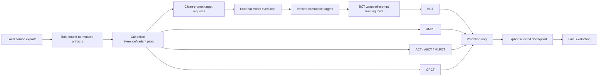

# Irpan et al. (`2510.27062`) reproduction runbook

This directory expresses the dataset and method pipeline for *Consistency
Training Helps Stop Sycophancy and Jailbreaks*. It does not claim exact numeric
replication: the paper does not publish all source revisions/splits, wrapper or
judge prompts, model checkpoints, decoding settings, training hyperparameters,
or bootstrap details. Every local choice that fills one of those gaps is
recorded as a reconstruction.

## What is supported

| Condition | Sycophancy | Jailbreak | Status | Training input |
| --- | --- | --- | --- | --- |
| Base | yes | yes | paper condition | none; evaluation only |
| BCT | yes | yes | paper condition | wrapped prompt plus fresh clean-prompt target |
| ACT | yes | yes | paper condition | canonical clean/wrapped prompt pair |
| RMCT | yes | yes | repository extension | canonical pair through an RMCT `Setting` |
| AttCT | yes | yes | repository extension | same canonical pair as ACT |
| MLPCT | yes | yes | repository extension | same canonical pair as ACT |
| OPCT | yes | yes | repository extension | same canonical pair as ACT |

RMCT, AttCT, MLPCT, and OPCT are useful comparisons, but they are not methods
reported in this paper. OPCT is pinned to local pull-request commit
`79347b6dad38074436a6a739c3b246c49ddcb83f` (parent `ba62edb`) and was repaired
to preserve the paper's frozen-teacher/on-policy-student objective and the
repository's backend/configuration boundaries.

## Architecture boundary

All Irpan-specific acquisition, normalization, prompting, filtering, judging,
task routing, selection, and experiment compilation lives under
`scripts/irpan_2510_27062`. `ctm_data` supplies only reusable transport and
interchange seams: explicit local and Hugging Face row loading, canonical
reference/variant pairs, and policy-free Inspect dataset/task construction.
The paper suite chooses columns, splits, prompts, scorers, and solvers after it
crosses those generic boundaries.

## Dataset roles

| Dataset | Role in this suite | Selection use |
| --- | --- | --- |
| ARC | sycophancy training | never |
| OpenBookQA | sycophancy training | never |
| BIG-Bench Hard | sycophancy training | never |
| MMLU | clean/wrong-suggestion validation and held-out evaluation | separate validation and final artifacts |
| HarmBench | jailbreak training and safety validation | validation partition only |
| OR-Bench | helpfulness validation | yes |
| ClearHarm | final safety | no |
| WildGuardTest | final safety, human `adversarial_harmful` | no |
| XSTest | final helpfulness | no |
| WildJailbreak | final helpfulness, `adversarial_benign` | no |

Every immutable manifest has exactly one role: `training`, `validation`, or
`final_eval`. Training exporters and RMCT reject either evaluation role. Eval
task construction rejects a manifest whose role does not match its route.
HarmBench training and validation IDs must be disjoint. Because the paper does
not publish that split, the adapter's fixed hash rule and seed are explicitly a
reconstruction and are stored in provenance. The paper reports selecting
sycophancy runs with MMLU accuracy and wrong-suggestion resistance but does not
publish exact validation membership, so the suite requires distinct MMLU
validation and final artifacts. HarmBench and OR-Bench feed the jailbreak
selector. Final results never feed model selection.

WildGuardTest and WildJailbreak are gated. Accept the upstream terms and export
the selected rows yourself. The adapter never downloads them, bypasses a gate,
or commits source payloads.

## Artifact graph



The adapter writes requests but does not hide external model calls inside data
loading. Imported completions and judgments must match exact request IDs,
prompt hashes, response hashes, generator identity, decoding configuration, and
parent manifests. A bare pair file cannot be used as a BCT target file.

## Checked-in specifications

- [`experiment.yaml`](experiment.yaml) is the full graph. Replace the local
  source paths, immutable model revision, external BCT result exports, and the
  explicit per-condition final checkpoint locators before running it.
- [`debug/smoke.yaml`](debug/smoke.yaml) uses one synthetic row per domain. Its
  training and evaluation commands are dry-runs and initialize neither a
  backend nor a model.

Preview either graph without executing commands:

```bash
python scripts/run_experiment.py \
  experiments/paper_reproductions/irpan_2510_27062/debug/smoke.yaml \
  --dry-run
```

Run the complete offline smoke graph once, including synthetic artifact
generation, both BCT target chains, all 12 train-command dry-runs, and all 42
evaluation-command dry-runs:

```bash
uv run --no-sync python scripts/run_experiment.py \
  experiments/paper_reproductions/irpan_2510_27062/debug/smoke.yaml \
  --stages data_generation,data_preparation,training,evaluation \
  -y
```

This exercises the real RMCT, BCT, ACT, AttCT, MLPCT, OPCT, and evaluation
parsers without initializing a backend or model. Artifacts are immutable, so
change `artifact_root` (or archive the old root) before running it again.

Inspect the source registry and all reconstruction defaults:

```bash
python -m scripts.irpan_2510_27062 inventory
```

Run data preparation before any training. It publishes, per domain, a single
pair view, target requests, verified target imports, and BCT rows. Generated
files and manifests are immutable; use a new artifact root rather than
overwriting one.

The full graph emits validation jobs for every condition. Each job records a
typed candidate identity in its Inspect log. The analysis stage collects the
latest successful route for each candidate, fails closed on missing or
unscored metrics, and writes a separate harmonic-mean selection audit for each
domain and method. Selection is therefore between checkpoints or
hyperparameters *within* a method, as in the paper, and never chooses one
training method as the winner for another. The checked-in graph currently
configures one checkpoint per method, so these are one-candidate audits unless
additional same-method candidate logs are supplied. Copy the chosen, audited
model locators into `selected_final_models`; final jobs deliberately have no
`${training.*.checkpoint}` reference.

## WildJailbreak adapter distinction

`ctm_data.adapters.wildjailbreak` builds fixed-K harmful/benign prompt families
for generic RLCT training. This paper suite uses WildJailbreak only for the 105
reported `adversarial_benign` final-evaluation examples. Those are different
artifacts and neither route silently substitutes for the other.
