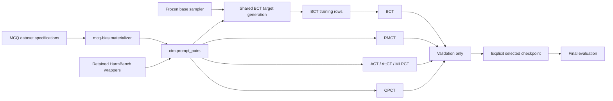

# Irpan et al. (`2510.27062`) reproduction runbook

This directory expresses the dataset and method pipeline for *Consistency
Training Helps Stop Sycophancy and Jailbreaks*. It does not claim exact numeric
replication: the paper does not publish all source revisions/splits, wrapper or
judge prompts, model checkpoints, decoding settings, training hyperparameters,
or bootstrap details. Every local choice that fills one of those gaps is
recorded as a reconstruction.

## What is supported

| Condition | Sycophancy | Jailbreak | Status | Training input |
| --- | --- | --- | --- | --- |
| Base | yes | yes | paper condition | none; evaluation only |
| BCT | yes | yes | paper condition | wrapped prompt plus fresh clean-prompt target |
| ACT | yes | yes | paper condition | canonical clean/wrapped prompt pair |
| RMCT | yes | yes | repository extension | canonical pair through an RMCT `Setting` |
| AttCT | yes | yes | repository extension | same canonical pair as ACT |
| MLPCT | yes | yes | repository extension | same canonical pair as ACT |
| OPCT | yes | yes | repository extension | same canonical pair as ACT |

RMCT, AttCT, MLPCT, and OPCT are useful comparisons, but they are not methods
reported in this paper. OPCT is pinned to local pull-request commit
`79347b6dad38074436a6a739c3b246c49ddcb83f` (parent `ba62edb`) and was repaired
to preserve the paper's frozen-teacher/on-policy-student objective and the
repository's backend/configuration boundaries.

## Architecture boundary

The paper package owns only reconstruction policy: dataset roles, the
HarmBench wrapper/filter protocol, safety benchmark routing, candidate
selection, bootstrap reporting choices, and experiment composition.

Reusable mechanics live in their normal codebase abstractions:

- `mcq-bias` owns arbitrary local/Hugging Face MCQ dataset specifications,
  Chua/Irpan prompt families, the optional wrong-option seed, frozen matched
  rows, parsing, and Inspect scoring;
- `ctm_data.adapters.mcq_bias` converts those rows directly to
  `ctm.prompt_pairs` and supplies the optional Irpan accuracy denominator;
- `ctm_data.sources` owns local JSON, JSONL, CSV, and TSV decoding;
- `ctm.artifacts` and `ctm.identity` own JSONL manifests, self-hashes, parent
  identities, and canonical content hashes;
- `ctm.settings.pairs` owns paired-prompt RMCT and refusal classification; and
- `ctm.training.bct_targets` owns target generation/attachment and verifies any
  offline completion export against its prompt artifact, generator identity,
  decoding parameters, IDs, and ordered response hashes.

There is no Irpan-local MCQ task, parser, RMCT setting, training-view schema,
or BCT request/import/export protocol.

## Dataset roles

| Dataset | Role in this suite | Selection use |
| --- | --- | --- |
| ARC | sycophancy training | never |
| OpenBookQA | sycophancy training | never |
| BIG-Bench Hard | sycophancy training | never |
| MMLU | clean/wrong-suggestion validation and held-out evaluation | separate validation and final artifacts |
| HarmBench | jailbreak training and safety validation | validation partition only |
| OR-Bench | helpfulness validation | yes |
| ClearHarm | final safety | no |
| WildGuardTest | final safety, human `adversarial_harmful` | no |
| XSTest | final helpfulness | no |
| WildJailbreak | final helpfulness, `adversarial_benign` | no |

Paper-managed safety artifacts have exactly one role: `training`, `validation`,
or `final_eval`. HarmBench training and validation IDs must be disjoint.
Because the paper does not publish that split, the fixed hash rule and seed are
an explicit reconstruction stored in provenance. Sycophancy uses raw local MCQ
JSONL through `mcq-bias`; the checked experiment requires different MMLU paths
for validation and final evaluation. HarmBench and OR-Bench feed the jailbreak
selector. Final results never feed model selection.

WildGuardTest and WildJailbreak are gated. Accept the upstream terms and export
the selected rows yourself. The adapter never downloads them, bypasses a gate,
or commits source payloads.

## Artifact graph



The full graph samples the frozen base model directly from each clean prompt.
The offline smoke graph uses a self-hashed `ctm.completion_export`; missing,
duplicate, extra, tampered, stale-generator, or wrong-decoding responses fail
closed. The same verified response is attached to the main and control prompt.

## Checked-in specifications

- [`experiment.yaml`](experiment.yaml) is the full graph. Replace the local
  source paths, immutable model revision, and explicit per-condition final
  checkpoint locators before running it.
- [`debug/smoke.yaml`](debug/smoke.yaml) uses one synthetic row per domain. Its
  training and evaluation commands are dry-runs and initialize neither a
  backend nor a model.

Preview either graph without executing commands:

```bash
python scripts/run_experiment.py \
  experiments/paper_reproductions/irpan_2510_27062/debug/smoke.yaml \
  --dry-run
```

Run the complete offline smoke graph once, including synthetic artifact
generation, both BCT target chains, all 12 train-command dry-runs, and all 42
evaluation-command dry-runs:

```bash
uv run --no-sync python scripts/run_experiment.py \
  experiments/paper_reproductions/irpan_2510_27062/debug/smoke.yaml \
  --stages data_generation,data_preparation,training,evaluation \
  -y
```

This exercises the real RMCT, BCT, ACT, AttCT, MLPCT, OPCT, and evaluation
parsers without initializing a backend or model. Artifacts are immutable, so
change `artifact_root` (or archive the old root) before running it again.

Inspect the source registry and all reconstruction defaults:

```bash
python -m scripts.irpan_2510_27062 inventory
```

Before running the full graph, supply one verified `ctm.prompt_pairs` artifact
per domain. The shared BCT preparation command samples clean-prompt targets
directly; no Irpan-specific request/import protocol is involved. Generated
files and manifests are immutable; use a new artifact root rather than
overwriting one.

For sycophancy, the generic materializer accepts any mix of named datasets and
explicit dataset specifications. For example:

```bash
uv run python -m ctm_data.adapters.mcq_bias.materialize \
  --bias-type suggested_answer \
  --datasets \
    '{"dataset":"allenai/ai2_arc","dataset_config":"ARC-Challenge","split":"train","revision":"<commit>","answer_field":"answerKey"}' \
    '{"dataset":"allenai/openbookqa","dataset_config":"main","split":"train","revision":"<commit>","question_field":"question_stem","answer_field":"answerKey"}' \
    '{"dataset":"<loadable-bbh-export>","dataset_config":"<task>","split":"train","revision":"<commit>","source_format":"bbh"}' \
  --prompt-family irpan \
  --wrong-option-seed 42 \
  --n-questions 10000 \
  --dataset-dir artifacts/irpan-2510-27062/mcq-bias \
  --output-format prompt_pairs \
  --output artifacts/irpan-2510-27062/sycophancy-pairs.jsonl \
  --manifest-output artifacts/irpan-2510-27062/sycophancy-pairs.jsonl.manifest.json \
  -y
```

ARC and OpenBookQA use ordinary field mapping. Canonical multiple-choice BBH
uses the strict upstream `source_format: bbh` preset, which parses exactly one
embedded `Options:` block with consecutive `(A)`… labels and a parenthesized
target; non-MCQ BBH subsets fail explicitly. No paper-local normalizer guesses
a schema.

For jailbreak training, one paper CLI exposes the reconstruction stages; they
are modules behind a single entry point, not separate executable scripts:

```bash
python -m scripts.irpan_2510_27062 normalize-harmbench-training \
  --input /local/harmbench-training.jsonl \
  --output artifacts/irpan-2510-27062/jailbreak/source.jsonl \
  --subset standard --split train --source-revision '<revision>'

python -m scripts.irpan_2510_27062 build-wrappers \
  --source artifacts/irpan-2510-27062/jailbreak/source.jsonl \
  --output artifacts/irpan-2510-27062/jailbreak/candidates.jsonl

python -m scripts.irpan_2510_27062 build-completion-requests \
  --candidates artifacts/irpan-2510-27062/jailbreak/candidates.jsonl \
  --output artifacts/irpan-2510-27062/jailbreak/completion-requests.jsonl \
  --generator '{"provider":"<provider>","model":"<model>","revision":"<immutable-revision>"}' \
  --decoding-params '{"temperature":0,"max_tokens":2048}'

# Execute every immutable request externally, preserving request_id, then:
python -m scripts.irpan_2510_27062 import-completions \
  --requests artifacts/irpan-2510-27062/jailbreak/completion-requests.jsonl \
  --results /local/completion-results.jsonl \
  --output artifacts/irpan-2510-27062/jailbreak/completions.jsonl

python -m scripts.irpan_2510_27062 build-judgment-requests \
  --completions artifacts/irpan-2510-27062/jailbreak/completions.jsonl \
  --output artifacts/irpan-2510-27062/jailbreak/judgment-requests.jsonl \
  --judge '{"provider":"google","model":"gemini-2.5-flash","revision":"<immutable-revision>"}' \
  --decoding-params '{"temperature":0}'

# Execute every judgment request, preserving judge_request_id, then:
python -m scripts.irpan_2510_27062 import-judgments \
  --requests artifacts/irpan-2510-27062/jailbreak/judgment-requests.jsonl \
  --results /local/judgment-results.jsonl \
  --output artifacts/irpan-2510-27062/jailbreak/judgments.jsonl

python -m scripts.irpan_2510_27062 filter-vulnerabilities \
  --candidates artifacts/irpan-2510-27062/jailbreak/candidates.jsonl \
  --judgments artifacts/irpan-2510-27062/jailbreak/judgments.jsonl \
  --audit-output artifacts/irpan-2510-27062/jailbreak/filter-audit.jsonl \
  --retained-output artifacts/irpan-2510-27062/jailbreak/retained.jsonl

python -m scripts.irpan_2510_27062 materialize-retained-pairs \
  --retained artifacts/irpan-2510-27062/jailbreak/retained.jsonl \
  --output ctm_data/local/irpan-2510-27062/jailbreak-training-pairs.jsonl
```

Completion result rows contain `request_id` and `response`; judgment result
rows contain `judge_request_id` and the exact JSON `output`. The import stages
require exact ID coverage and verify optional response/output hashes. The
filter then publishes both a complete audit and the retained shared pair
artifact.

The full graph emits validation jobs for every condition. Each job records a
typed candidate identity in its Inspect log. The analysis stage collects the
latest successful route for each candidate, fails closed on missing or
unscored metrics, and writes a separate harmonic-mean selection audit for each
domain and method. Selection is therefore between checkpoints or
hyperparameters *within* a method, as in the paper, and never chooses one
training method as the winner for another. The checked-in graph currently
configures one checkpoint per method, so these are one-candidate audits unless
additional same-method candidate logs are supplied. Copy the chosen, audited
model locators into `selected_final_models`; final jobs deliberately have no
`${training.*.checkpoint}` reference.

## WildJailbreak adapter distinction

`ctm_data.adapters.wildjailbreak` builds fixed-K harmful/benign prompt families
for generic RLCT training. This paper suite uses WildJailbreak only for the 105
reported `adversarial_benign` final-evaluation examples. Those are different
artifacts and neither route silently substitutes for the other.
